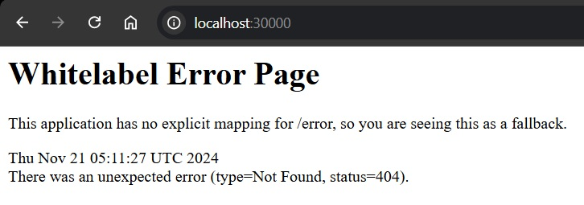
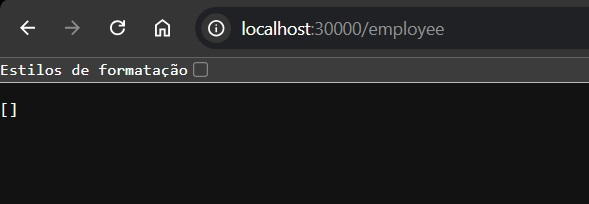
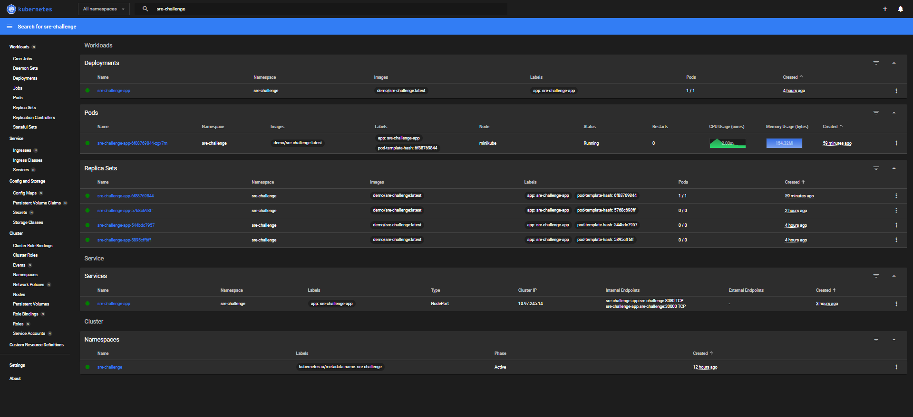

## Bem-vindo

Estamos muito felizes por você estar pensando em se juntar a nós! Esse é um teste feito para conhecer um pouco mais de cada candidato. Não se trata de um teste objetivo, capaz de gerar uma nota ou uma taxa de acerto, mas sim de um estudo de caso com o propósito de conhecer os conhecimentos, experiências e modo de trabalhar de um candidato. Não experamos que tudo seja feito perfeitamente, pois valorizamos o seu tempo. Sinta-se livre para desenvolver sua solução para o problema proposto.

Este desafio está dividido em 4 partes:

1. Implementação
2. Depuração
3. Melhorias
4. Perguntas

## Requisitos para o desafio

- Github Account

Se você encontrar possíveis melhorias a serem feitas neste desafio, fique a vontade para descreve-lás.

## Sobre o Desafio:

A ELO executa a maior parte de sua infraestrutura em Kubernetes. É um monte de microserviços conversando entre si e realizando diversas tarefas.

Nesse repositório, fornecemos a você:

- 'sre-challenge-app/': Uma aplicação com CRUD que armazena dados de funcionários em um Banco de dados MySQL 8.

### Configure o ambiente do desafio

1. Instale qualquer cluster K8s local (ex: Minikube) em sua máquina e documente sua configuração, para que possamos executar sua solução.

Documentação de 
[Configuração Ambiente](./Minikube.md)
---

### Parte 1 - Configure os aplicativos

Gostariamos que essa aplicação sre-challenge-app e seu banco de dados fossem executados em um cluster K8s.

Requisitos

1. A aplicação deve ser acessível de fora do cluster.
<div style="display: flex; justify-content: center; align-items: center; gap: 10px;">
  
  
</div>

2. Manifestos de implantação do kubernetes para executar com limitação de requests e usando HPA.
    
      [deployment-app.yaml](k8s\deployment-app.yaml)

      Utilizei o postman para realizar teste de carga e garantir que o HPA estava funcionando corretamente, não consegui printar pois a carga acabou congelando meu pc, porém consegui o histórico de pods. 
      

### Parte 2 - Corrigir o problema

A aplicação tem um problema. Encontre e corrija! Você saberá que corrigiu o problema quando o estado dos pods no namespaces for semelhante a este:

```
NAME                                 READY   STATUS    RESTARTS   AGE
db-5877fd4d4d-qmngl                  1/1     Running   0          6m50s
sre-challenge-app-59fd5ffc57-lm2xs   1/1     Running   0          7s
```

Requisitos

Escreva aqui sobre o problema, a solução, como você a encontrou e qualquer outra coisa que queira compartilhar sobre ela.

1. No arquivo de configuração [application.properties](src\main\resources\application.properties)

        spring.datasource.url=jdbc:mysql://test:3306/emp?allowPublicKeyRetrieval=true&useSSL=false

    Mostra que a aplicação espera que o banco esteja acessível no host test na porta 3306, com o banco de dados chamado emp.
    
    Ajustei isso para usar o Service do Kubernetes como host, que chamaremos de db.

    Desta forma a aplicação ficou running pois conseguiu chegar ao banco. 

### Parte 3 - Melhores práticas

Essa aplicação tem uma falha de segurança e gostariamos que as credenciais do MYSQL fossem armazenadas em uma secret do Kubernetes.

Requisitos
1. Manifesto do kubernetes usando a API de secret com as credenciais do Banco para implantação.

      [mysql-secret.yaml](k8s\mysql-secret.yaml)
2. Manifesto do kunernetes da aplicação com as informações da secret criada anteriormente.

      [deployment-app.yaml](k8s\deployment-app.yaml)

      [deployment-db.yaml](k8s\deployment-db.yaml)
2. Configuração do código da aplicação utilizando uma variável que foi referenciada no secrets do K8s (Application Properties do Java)

      [application.properties](src\main\resources\application.properties)

### Parte 4 - Perguntas

Sinta-se à vontade para expressar seus pensamentos e compartilhar suas experiências com exemplos do mundo real com os quais você trabalhou no passado.

Requisitos
O que você faria para melhorar essa configuração e torná-la “pronta para produção”?

- Em [deployment-app.yaml](k8s\deployment-app.yaml) liha 27 removeria 

  1. `allowPublicKeyRetrieval=true` pois a melhor prática seria configurar um certificado seguro no servidor MySQL e usar um cliente que já tenha a chave pública armazenada.
  2. `useSSL=false` Habilitaria SSL para que os dados sejam criptografados durante a transmissão.

  3. Observabilidade e logs - Configurar ferramentas de monitoramento e logs para facilitar a identificação de problemas.

  4. TLS e autenticação - Implementar TLS nos serviços para criptografar o tráfego.

  5. LoadBalancer - Criaria um balanceador de carga externo em um provedor de nuvem - restringindo os acesso com regras de firewall.

Existem 2 microsserviços mantidos por 2 equipes diferentes. Cada equipe deve ter acesso apenas ao seu serviço dentro do cluster. Como você abordaria isso?
- Autenticação e Autorização via RBAC -
Implementaria RBAC (Role-Based Access Control) no cluster para garantir que cada equipe tenha acesso apenas aos recursos (pods, serviços, etc.) do microsserviço sob sua responsabilidade.

    [role-app.yaml](prd\role-app.yaml)

- Segurança na comunicação dos pods - Usaria Network Policies para controlar a comunicação entre serviços.

Como você evitaria que outros serviços em execução no cluster se comunicassem com o sre-challenge-app?

- Namespaces separados para microsserviços:

1. Criar namespaces diferentes para cada serviço, isolando os recursos.

    Exemplo:
      
        Namespace team-a-service para sre-challenge-app.
        Namespace team-b-service para outro microsserviço.
    Isso impede que equipes alterem ou visualizem acidentalmente os recursos de outras equipes.

## O que é importante para nós?

É claro que esperamos que a solução funcione, mas também queremos saber como você trabalha e o que é importante para você como engenheiro. Portanto, fique à vontade para criar novos arquivos, refatorar, renomear, ...

Idealmente, gostaríamos de ver sua progressão através de commits, verbosidade em suas respostas e todos os requisitos atendidos. Não se esqueça de atualizar o README.md para explicar seu processo de pensamento.

## Entrega do desafio:

Ao terminar o desafio, convide o 'ELO-SRE' para contribuir com o seu repositório de desafios para que possamos fazer a avaliação. Boa Sorte

<p align="center">
  
</p>

# Espero não ter esquecido de nada =D

Yuri Pastore Aranha da Silva
959348434
<p align="center">
  
</p>